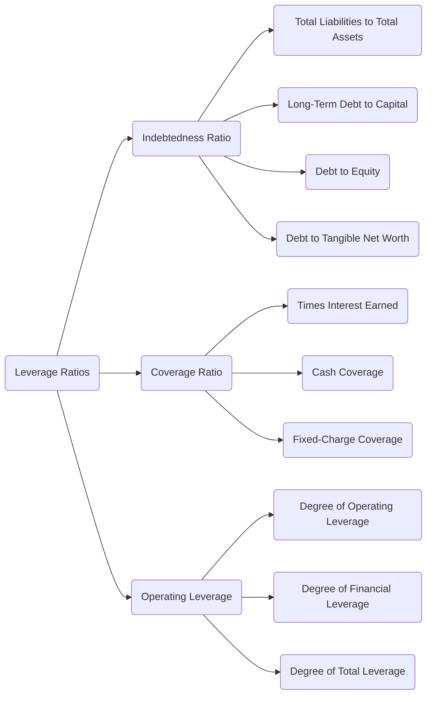
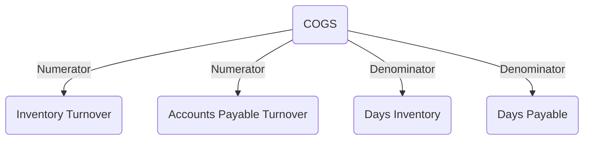
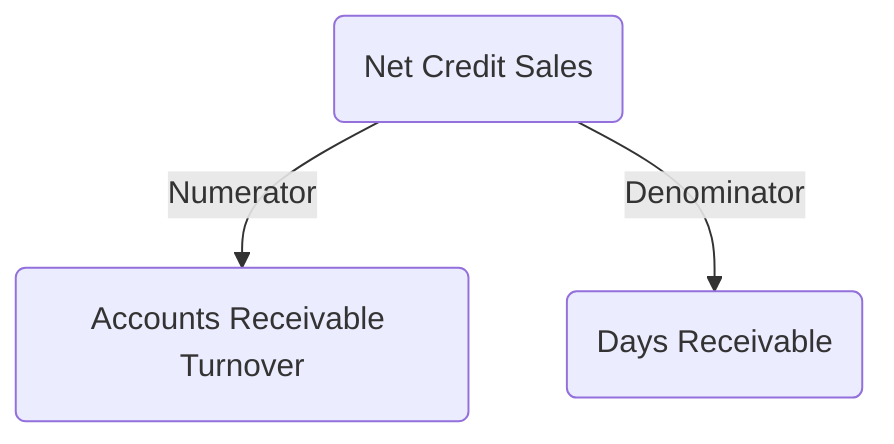
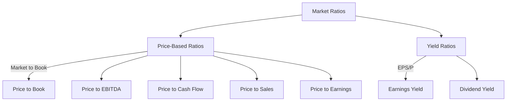

# Financial Analysis Formulas

---

## Topic 2: Liquidity Ratios

### 1. Current Ratio
$$\frac{\text{Current Assets}}{\text{Current Liabilities}}$$

---

### 2. Quick Ratio
$$\frac{\text{Cash} + \text{Short-term Investments} + \text{AR}}{\text{Current Liabilities}}$$

---

### 3. Cash Ratio
$$\frac{\text{Cash} + \text{Short-term Investments}}{\text{Current Liabilities}}$$

---

**Summary table:**

| Ratio | Formula | Excludes |
|---|---|---|
| Current Ratio | Current Assets / Current Liabilities | Nothing |
| Quick Ratio | (Cash + ST Investments + AR) / Current Liabilities | Inventory & prepaid |
| Cash Ratio | (Cash + ST Investments) / Current Liabilities | AR, inventory, prepaid |

The three ratios form a hierarchy of increasing conservatism — Current → Quick → Cash — each stripping away less-liquid assets from the numerator.

---

## Topic 3: Leverage Ratios

---

### Indebtedness Ratios

**1. Total Liabilities to Total Assets**
$$\frac{\text{Total Liabilities}}{\text{Total Assets}}$$

**2. Long-Term Debt to Capital**
$$\frac{\text{Long-Term Debt}}{\text{Long-Term Debt} + \text{Equity}}$$

**3. Debt to Equity**
$$\frac{\text{Total Debt}}{\text{Total Equity}}$$

**4. Debt to Tangible Net Worth**
$$\frac{\text{Total Debt}}{\text{Total Equity} - \text{Intangible Assets}}$$

---

### Coverage Ratios

**5. Times Interest Earned (TIE)**
$$\frac{\text{EBIT}}{\text{Interest Expense}}$$

**6. Cash Coverage**
$$\frac{\text{EBITDA}}{\text{Interest Expense}}$$

**7. Fixed-Charge Coverage**
$$\frac{\text{EBIT} + \text{Fixed Charges}}{\text{Interest Expense} + \text{Fixed Charges}}$$

---

### Operating Leverage

**8. Degree of Operating Leverage (DOL)**
$$\frac{\% \text{ Change in EBIT}}{\% \text{ Change in Revenue}}$$

**9. Degree of Financial Leverage (DFL)**
$$\frac{\% \text{ Change in Net Income}}{\% \text{ Change in EBIT}}$$

**10. Degree of Total Leverage (DTL)**
$$DOL \times DFL$$

---

| Category | Ratio | Formula |
|---|---|---|
| Indebtedness | Total Liabilities to Total Assets | Total Liabilities / Total Assets |
| Indebtedness | Long-Term Debt to Capital | LTD / (LTD + Equity) |
| Indebtedness | Debt to Equity | Total Debt / Total Equity |
| Indebtedness | Debt to Tangible Net Worth | Total Debt / (Total Equity − Intangibles) |
| Coverage | Times Interest Earned | EBIT / Interest Expense |
| Coverage | Cash Coverage | EBITDA / Interest Expense |
| Coverage | Fixed-Charge Coverage | (EBIT + Fixed Charges) / (Interest + Fixed Charges) |
| Operating | DOL | % Δ EBIT / % Δ Revenue |
| Operating | DFL | % Δ Net Income / % Δ EBIT |
| Operating | DTL | DOL × DFL |

---

## Topic 4: Activity Ratios

**Key rules:**
- Turnover ratios using inventory/payables → **COGS** as numerator
- Turnover ratios using assets → **Revenue** as numerator
- Activity ratios affect **Working Capital** → affects **Free Cash Flow**

---

### Turnover Ratios

**1. Inventory Turnover**
$$\frac{\text{Cost of Goods Sold}}{\text{Average Inventory}}$$

**2. Accounts Receivable Turnover**
$$\frac{\text{Net Credit Sales}}{\text{Average Accounts Receivable}}$$

**3. Accounts Payable Turnover**
$$\frac{\text{COGS}}{\text{Average Accounts Payable}}$$

**4. Current Asset Turnover**
$$\frac{\text{Revenue}}{\text{Average Current Assets}}$$

**5. Fixed Asset Turnover**
$$\frac{\text{Revenue}}{\text{Average Net Fixed Assets}}$$

**6. Total Asset Turnover**
$$\frac{\text{Revenue}}{\text{Average Total Assets}}$$

---

### Days Ratios

**7. Days Inventory (DI)**
$$\frac{\text{Average Inventory}}{\text{COGS}} \times \text{Number of Days in Period}$$

**8. Days Receivables (DR)**
$$\frac{\text{Average Accounts Receivable}}{\text{Net Credit Sales}} \times \text{Number of Days in Period}$$

**9. Days Payables (DP)**
$$\frac{\text{Average Accounts Payable}}{\text{COGS}} \times \text{Number of Days in Period}$$

---

### Derived Metrics

**Operating Cycle**
$$\text{Operating Cycle} = DI + DR$$

**Cash Conversion Cycle** *(implied)*
$$\text{CCC} = DI + DR - DP$$

---

---

| Ratio | Formula | Numerator |
|---|---|---|
| Inventory Turnover | COGS / Avg Inventory | COGS |
| AR Turnover | Net Credit Sales / Avg AR | Revenue |
| AP Turnover | COGS / Avg AP | COGS |
| Current Asset Turnover | Revenue / Avg Current Assets | Revenue |
| Fixed Asset Turnover | Revenue / Avg Net PP&E | Revenue |
| Total Asset Turnover | Revenue / Avg Total Assets | Revenue |
| Days Inventory | (Avg Inventory / COGS) × Days | — |
| Days Receivables | (Avg AR / Net Credit Sales) × Days | — |
| Days Payables | (Avg AP / COGS) × Days | — |

---

## Topic 5: Profitability Ratios & Performance Measures

---

### Margin Ratios

**1. Gross Profit Margin**
$$\frac{\text{Revenue} - \text{COGS}}{\text{Revenue}}$$

**2. EBIT Margin**
$$\frac{\text{EBIT}}{\text{Revenue}}$$

**3. EBITDA Margin**
$$\frac{\text{EBITDA}}{\text{Revenue}}$$

**4. Net Profit Margin**
$$\frac{\text{Net Income}}{\text{Revenue}}$$

---

### Return Ratios

**5. ROA — Return on Assets**
$$\frac{\text{Net Income}}{\text{Average Total Assets}}$$

**6. ROE — Return on Equity**
$$\frac{\text{Net Income}}{\text{Average Total Equity}}$$

**7. ROE — DuPont Analysis**
$$\frac{\text{Net Income}}{\text{Revenue}} \times \frac{\text{Revenue}}{\text{Average Total Assets}} \times \frac{\text{Average Total Assets}}{\text{Average Equity}}$$

**8. ROIC — Return on Invested Capital**
$$\frac{\text{Net Income}}{\text{Long-term Debt} + \text{Equity}}$$

**9. ROI — Return on Investment**
$$\frac{\text{Gain from Investment} - \text{Cost of Investment}}{\text{Cost of Investment}}$$

**10. Basic EPS**
$$\frac{\text{Net Income} - \text{Preferred Dividends}}{\text{Weighted Average Outstanding Shares}}$$

**11. Diluted EPS**
$$\frac{(\text{Net Income} - \text{Preferred Dividends}) + (\text{Convertible Preferred Dividends} + \text{Convertible Bond After-Tax Interest})}{\text{Weighted Average Common Shares} + \text{Diluted Shares}}$$

---

### Performance Measures

**12. Free Cash Flow (FCF)**
$$\text{Cash Flow from Operating Activities} - \text{Capital Expenditures}$$

**13. Free Cash Flow to the Firm (FCFF)**
$$\text{OCF} + [\text{Interest Expense} \times (1 - \text{Tax Rate})] - \text{CapEx}$$

**14. Free Cash Flow to Equity (FCFE)**
$$\text{OCF} - \text{CapEx} + \text{Change in Total Debt}$$

**15. Economic Profit (EVA)**
$$\text{EBIT} \times (1 - \text{Tax Rate}) - (\text{Average Capital Employed} \times \text{WACC})$$

**16. Net PP&E**
$$\text{Gross Fixed Assets} + \text{Capital Expenditures} - \text{Accumulated Depreciation}$$

---

### FCF Comparison

| Metric | Formula | Use Case |
|---|---|---|
| FCF | OCF − CapEx | General cash generation |
| FCFF | OCF + Interest×(1−t) − CapEx | Enterprise valuation (all capital providers) |
| FCFE | OCF − CapEx + Δ Debt | Equity valuation / dividend capacity |

> **Key relationship:** `FCFE = FCFF − Net Debt Repayments`
> The tax-adjusted interest `[Interest × (1 − Tax Rate)]` appears in both FCFF and FCFE because interest is tax-deductible, creating a shield that increases available cash flow.

---

| Category | Ratio | Numerator | Denominator |
|---|---|---|---|
| Margin | Gross Profit Margin | Revenue − COGS | Revenue |
| Margin | EBIT Margin | EBIT | Revenue |
| Margin | EBITDA Margin | EBITDA | Revenue |
| Margin | Net Profit Margin | Net Income | Revenue |
| Return | ROA | Net Income | Avg Total Assets |
| Return | ROE | Net Income | Avg Total Equity |
| Return | ROIC | Net Income | LT Debt + Equity |
| Return | ROI | Gain − Cost | Cost of Investment |
| Return | Basic EPS | NI − Pref Div | Wtd Avg Shares |
| Return | Diluted EPS | Adj. NI | Wtd Avg + Diluted Shares |
| Performance | FCF | OCF − CapEx | — |
| Performance | FCFF | OCF + Int×(1−t) − CapEx | — |
| Performance | FCFE | OCF − CapEx + ΔDebt | — |
| Performance | Economic Profit | EBIT×(1−t) − (Capital × WACC) | — |

---

## Topic 6: Market Ratios

---

### Price-Based Ratios

**1. Price to Earnings (P/E)**
$$\frac{\text{Stock Price per Share}}{\text{Earnings per Share}}$$

**2. Price to Book (P/B) — Market to Book**
$$\frac{\text{Stock Price per Share}}{\text{Book Value per Share}}$$

**3. Price to Sales (P/S)**
$$\frac{\text{Stock Price per Share}}{\text{Revenue per Share}}$$

**4. Price to EBITDA**
$$\frac{\text{Stock Price per Share}}{\text{EBITDA per Share}}$$

**5. Price to Cash Flow**
$$\frac{\text{Stock Price per Share}}{\text{Operating Cash Flow per Share}}$$

---

### Yield Ratios

**6. Earnings Yield (EPS/P)** *(inverse of P/E)*
$$\frac{\text{Earnings per Share}}{\text{Stock Price per Share}}$$

**7. Dividend Yield**
$$\frac{\text{Annual Dividends per Share}}{\text{Stock Price per Share}}$$

---

### Use Cases & Comparability

| Ratio | Formula | Comparability | Best For |
|---|---|---|---|
| P/E | Price / EPS | Cross-Industry | Universal earnings valuation |
| P/B | Price / Book Value | Same Industry | Asset-heavy industries (banking, real estate) |
| P/S | Price / Revenue | Cross-Industry | Companies at different growth stages |
| P/EBITDA | Price / EBITDA | Same Industry | Capital-intensive industries (telecom, utilities) |
| P/CF | Price / OCF | Same Industry | Cash-heavy operations (oil & gas) |
| Earnings Yield | EPS / Price | Cross-Industry | Return-on-investment perspective |
| Dividend Yield | Annual Div / Price | Same Industry | Stable dividend industries (utilities, REITs) |

> **Key insight:** Price-based ratios use **market price as numerator** for valuation comparisons. Yield ratios flip the perspective to show **return per dollar invested**.

---

## Topic 7: Time Value of Money

---

### Lump Sum Formulas

**1. Present Value of a Lump Sum**
$$PV = \frac{FV}{(1+i)^n}$$

**2. Future Value of a Lump Sum**
$$FV = PV(1+i)^n$$

---

### Annuity Formulas

**3. PV of Ordinary Annuity**
$$PMT \times \left(\frac{1}{i} - \frac{1}{i(1+i)^n}\right)$$

*Alternate form:*
$$PMT \times \frac{1-(1+r)^{-n}}{r}$$

**4. FV of Ordinary Annuity**
$$PMT \times \frac{(1+i)^n - 1}{i}$$

**5. FV of Annuity Due**
$$PMT \times \frac{(1+i)^n - 1}{i} \times (1+i)$$

> *Annuity Due = Ordinary Annuity × (1+i) — payments occur at the beginning of each period.*

---

### Perpetuity Formulas

**6. PV of Perpetuity**
$$PV = \frac{PMT}{i}$$

**7. PV of Growing Perpetuity**
$$PV = \frac{PMT_0 \times (1+g)}{i - g}$$

---

### Growing Annuity

**8. PV of Growing Annuity**
$$PV = \frac{C_1}{r - g} \left[1 - \left(\frac{1+g}{1+r}\right)^n\right]$$

*Where $C_1 = PMT_0 \times (1+g)$ is the first period payment.*

---

### Deferred Cash Flows

**9. Present Value of Deferred Cash Flows** *(2-step process)*

1. Calculate PV at the start of the annuity period using standard PV formula
2. Discount that result back to today: $PV_0 = \frac{PV_{\text{deferred}}}{(1+i)^t}$

---

### Equivalent Annual Annuity

**10. Equivalent Annual Annuity (EAA)**
$$EAA = \frac{NPV}{\dfrac{1 - \frac{1}{(1+i)^n}}{i}}$$

*Used to compare projects with unequal lives by expressing NPV as an equivalent annual cash flow.*

---

| Formula | Expression | Key Variable |
|---|---|---|
| PV of Lump Sum | $\frac{FV}{(1+i)^n}$ | Discount rate i, periods n |
| FV of Lump Sum | $PV \times (1+i)^n$ | Compound rate i, periods n |
| PV of Ordinary Annuity | $PMT \times \frac{1-(1+r)^{-n}}{r}$ | Payment PMT |
| FV of Ordinary Annuity | $PMT \times \frac{(1+i)^n-1}{i}$ | Payment PMT |
| FV of Annuity Due | $PMT \times \frac{(1+i)^n-1}{i} \times (1+i)$ | Timing adjustment |
| PV of Perpetuity | $\frac{PMT}{i}$ | No terminal date |
| PV of Growing Perpetuity | $\frac{PMT_1}{i-g}$ | Growth rate $g < i$ |
| PV of Growing Annuity | $\frac{C_1}{r-g}\left[1-\left(\frac{1+g}{1+r}\right)^n\right]$ | Finite growing payments |
| PV of Deferred Cash Flows | 2-step: PV then discount back | Deferral period t |
| Equivalent Annual Annuity | $\frac{NPV}{\frac{1-\frac{1}{(1+i)^n}}{i}}$ | Compare unequal-life projects |

---

## Topic 8: Cash Flow Estimation and Valuation

**1. Initial Cash Outlay**
$$\text{Initial Cash Outlay} = -(\text{Purchase Price} + \text{Shipping and Installation Cost} + \text{EFR})$$
